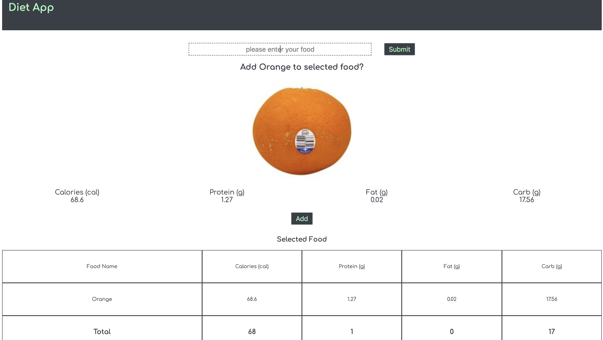

# Diet App


<br/>
<br/>
<br/>
<br/>
<br/>
<br/>
<br/>
<br/>
<br/>
<br/>

This is a simple nutrition calculator developed with LitElement, LitHTML, Redux and nutritionix API. This app supports natural language. User can get basic calories, fat, carb and protein info by entering keywords like "1 cup flour, 1 pinch of salt, and 1 cup butter".


## Getting Started

 To get up and running with this project, run the following commands from the project root direction.

 1. Install the project's dependencies using `npm`.

 ```
 npm install

 ```

 2. Skip this step if you have installed the Polymer CLI. Dependencies were imported by their npm package names. Since web browsers need to know a file’s full URL to import it, the development server included in Polymer CLI converts module names to paths.

 ```
 npm install -g polymer-cli

 ```

 3. Start local development server

 ```
 polymer serve

 ```

 4. Browse to the application URL.

 
